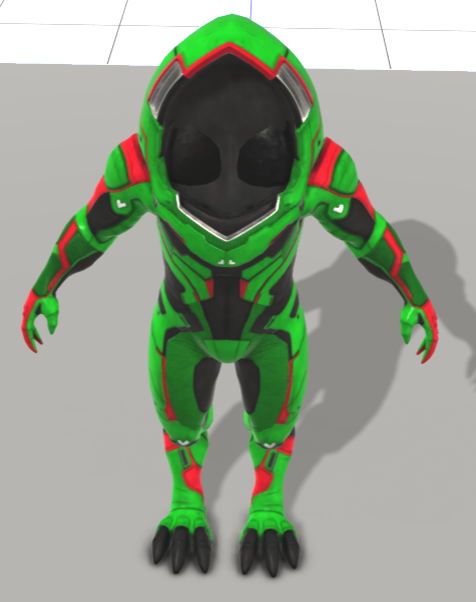
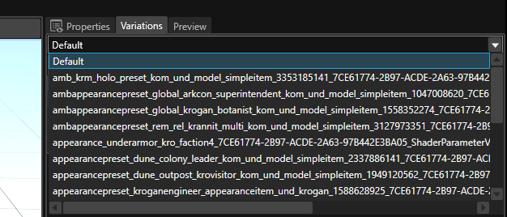
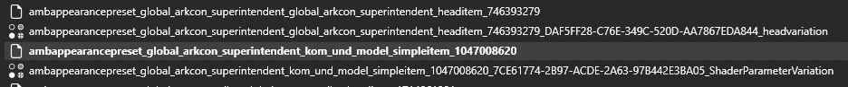

# First Attempt at Re-colouring Kesh

Mass Effect Andromeda allows you to tweak colours without having to create texture which makes simple re-colours very quick and easy. You do this by tweaking.

A Youtube guide on doing this is here:  [Youtube - Frosty Editor - Mass Effect Andromeda - Editing Outfit Colours via EBX edit within the Editor](https://www.youtube.com/watch?v=oDTSRM9yw3w)

## My Attempt 1 - wrong but helpful

Find the model. This is done by trial and error and looking through several sub folder:

I found the Krogan Model here:

* game/characters/krogan/kom/0_armors/kom_und_a/model/kom_und_model_mesh

Modify the materials colours:

* materials/[\*]/shader/vectorsParameters/[\*]

Each vectorParameter controls different things and depending on what you tweak it changes different things.

Value is a RGB value where 1 is full and 0 is red. You can use a color picker like this [Google Colour Picker](https://www.google.com/search?q=rgb%20colour%20picker)

You will get a value like which is a green colour. To translate this into the 0->1 scale. Divide the number by 255. So this value becomes::

* RGB colour code: `12, 214, 22`
* 0->1 Colour Code: `0.047058, 0.839215, 0.086274`

The main ones that change colour are:

* Tint_Color_A, B, C = normally the main colour
* MP_Light = Not a clue, at a guess, I assume it set the users torch/light colour which for most NPCs are not used
* ColorPhong = Not a clue??

The preview changed!

  

I am successful, I thought. So I saved the project, exported it as a mod, then viola it was working... **no**.

What did I do wrong, well I had modify the default model only. So if it was using the default model we would have seen a green suit, however most things don't use the default outfit. Check out attempt 2.

## My Attempt 2 - also wrong but closer

So onto Discord I went to ask for help. And help I got, and completely mis-understood.

There advice was more than this but all I heard was - choose the correct variation to edit.

How do you choose the variation. Open the model, then in the top right, next to the properties tab, choose Variations tab.

Now on the drop down Default, change this to the correct variation. For Kesh its this one. How did I figure that out. Munchyfly told me, but if you read the name it can make sense

* ambappearancepreset_global_arkcon_superintendent_kom_und_model_simpleitem_1047008620

Broke down the name is:

* ambappearancepreset - Appearance Preset - so look in appearancepresentitem
* global - The location, also kar, nex, rem, etc
* arkcon - Something to do with the ark
* superintendent - Kesh likely wasn't named Kesh originally, so she is the "superindendent" of the Nexus
* kom_und - Krogan, the M or F seems to point to M is body, F is head
* model_simpleitem - model simple item
* 1047008620 - identifier (very important)

I ticked the preview and viola I could see Kesh's model with the colours applied. I though perfect.

I then modified the MaterialCollection directly on this tab and noticed the preview didn't update. Guess what, that is the wrong place to do it. I did the edits, saved it, exported it as a mod. Played ME-A and she was still blue.

## My Attempt 3 with more hand-holding from Discord

Back to Discord I went, this time with a bit more begging for help.

This time I was told the same thing but this time with a few more pieces of information. My brain this time understood it and the eureka moment hit.

I needed to edit the appearance preset, not the model. I was modifying the model directly, which makes sense when I need to modify the model. But I actually want to modify the colour template (the preset)

So first to find the preset. Remember the name of the variant:
* ambappearancepreset_global_arkcon_superintendent_kom_und_model_simpleitem_1047008620

So first look in
* appearancepresetitem - this is a HUGE file list and Frosty really could do with a filter option to make this much easier to look through
* You will see several entries similar to what you are looking for, but you want to edi the one with the exact name match:

  

* Open - ambappearancepreset_global_arkcon_superintendent_kom_und_model_simpleitem_1047008620
* Now on the top bar, click on View Instances
* Select the 3rd option - why the third one??
* Change the values of Tint_Color_A, B and C to my green.
* Create the mod and Viola, Kesh is now a shade of green.
