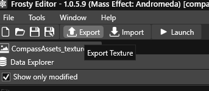
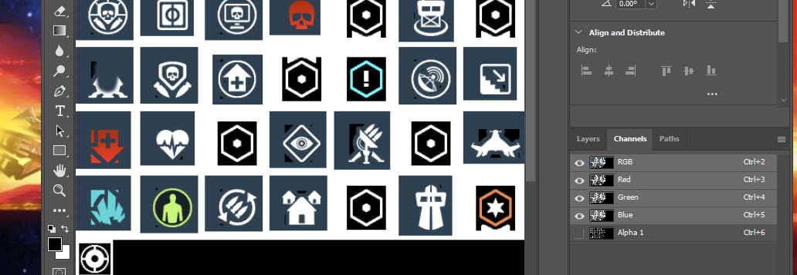
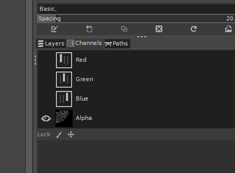
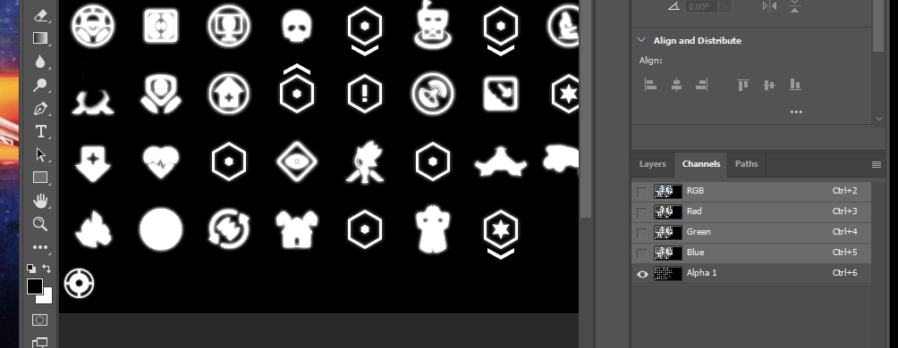

# First attempt at changing some Textures

Mass Effect Andromeda allows you to tweak some textures and this is how my first attempt went when changing the textures of Icons.

A YouTube guide on doing this is here:  [DAI + MEA Texture Tutorial by Gina](https://www.youtube.com/watch?v=ZTaXNI1zO28)

## My Attempt 1 - but I got the basics right

Find the texture you wanted to change. This is done by trial and error and looking through several sub folder:

I found the compass texture first:

* Game/UI/HUD/Compass/CompassAssets_texture

First I needed to export the texture and edit it using my preferred Graphics editor. I have both Photoshop and GIMP but I prefer to use GIMP but Photoshop is easier and simpler to use than GIMP so most use Photoshop for texture changes.

I exported the texture by open the Texture in Frosty Editor, then clicking export on the top bar. __DO NOT RIGHT CLICK -> EXPORT - that is wrong and will create a .bin file__

Then I choose my file type preference, PNG. _(this is the wrong choice as I will find out)_

Now open this in GIMP, and I can see the texture. Perfect.

Now I edit it, I re-colour the enemy icon green and I remove a bit from the forward station (so its clear my edits are taking affect). _This edit screenshot is from Photoshop but I actually did the edit in GIMP:_

Save the file as a PNG _(this is the wrong choice again)_ and viola a new Texture.

Now re-open the texture you want to change in Frosty Editor. In my case:

* Game/UI/HUD/Compass/CompassAssets_texture

Then on the top bar press import on the top bar and select your new texture. Viola you have changed the texture.

Now save it and export it to a mod and load it into your game and... nothing changed...

## My Attempt 2 - wrong again but I learnt about the alpha channel

What did I mess up? I tried quite a few different edits and tweaks and found nothing. Off I went to the Mass Effect Modding Discord to ask for some guidance.

__Alpha Channel__ - I didn't change this as I had no idea what that was, its the transparency layer - [Alpha Channel](https://www.techopedia.com/definition/1945/alpha-channel)

I never touched this but as my edits original changed the circle to a cross for a visual change I didn't modify the alpha channel so my edits were being ignore anyway as the edits were in the full transparency of the alpha channel. I went into photoshop as I knew how to check the ARGB channels but I later found out you can also check in GIMP.

I don't see an alpha channel in Photoshop - well this is because PNG and Photoshop don't play very well depending on how the png was created. So I moved to using TGA source files.

GIMP:

Photoshop:

Now I edited the Alpha Channel, re-imported it, created mod and loaded the game... and... nothing...

## My Attempt 3 - right this time, two texture files...

BAck to discord I went and viola I found the cause with help from MunchyFly. The solution, try one of the other textures. Yes, the issues I was caused by me editing the wrong file. Seems the compass file is the wrong file to edit adn instead I needed to edit the one below. _I still don't know if the compass file I originally edited is used in the game but I saw no changes from my edits_

* Game/UI/WorldMap/WorldMapAssets_texture

Repeat the edits, leaving GIMP manage the alpha channel (using TGA source files), and viola - it worked. My edits were in the game.
__So note to self, make sure you check if there are duplicate texture files and the one you are editing is the correct one__

## Things I learnt

This is a summary of my learning:

* MEA uses the alpha channel for transparency so if not set correctly by the tool you are using it will make all icons invisible
* PNG has alpha channel headaches with certain tools depending on how they are saved and exported but using them in MEA texture modding is "do-able" just be warned
* There are duplicate files with duplicate textures, which is the right one. Just trial and error
* Discord is as helpful as always, and they are always willing to help
