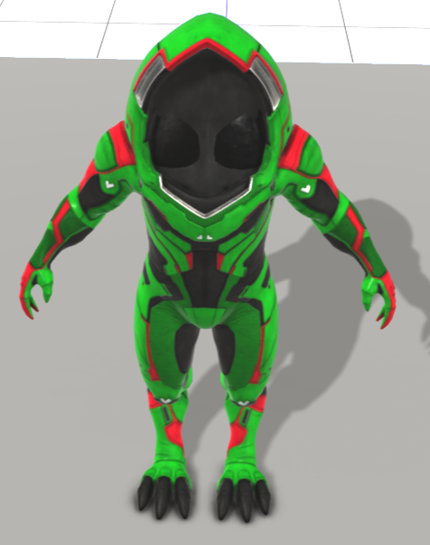

# Re-colouring Guide

Using Frosty Editor, you can easily re-colour nearly all outfits with some simple edits to colour codes. *There are some limits to this, when changing certain things like the fabric*

## Where to start

First thing to do is fine the a model. For this we will re-colour Krogan Armour colours.

## Modify the material colours

Open any model and on the right panel

* materials/[\*] - Array of different materials - armours, head, etc
* /shader/vectorsParameters/[\*] - Each vectorParameter controls different things and depending on what you tweak it changes different things.

Colour values are on an RGB except using a 0 to 1 scale. I created a colour picker HTML page that you can pick any colour or put in RGB codes and it will convert to a 0 to 1 scale [Utilities / Colour Picker](../Utilities/colour-picker.html)

> If you want to do this math yourself, take the RGB number e.g. 245 and divide by 255 will give you 0.960784. Each number in the RGB sequence will need to be converted
>
> * RGB colour code: `12, 214, 22`
> * 0 -> 1 Colour Code: `0.047058, 0.839215, 0.086274`

The main vectorParameters are:

* Tint_Color_A, B, C = normally the main colours of each armour
* stripe_Color_A, B, C = highlight strips on each armour piece (normally small highlights)
* Armor_Highlight = Highlight Colours
* Hazard = Colour tweaks for specific weather hazards
  * Hazard_Dust_color
  * Hazard_ice_color
* MP_Light = Not a clue, at a guess, I assume it set the users torch/light colour which for most NPCs are not used
* ColorPhong = Not a clue??

Changing the colour codes will update the preview on the left hand side, like the example below of a Green Krogan

The preview will default only to the "default" variation. Variations are all different variants of that one model. Instead of saving all krogan armour as individual files, Frosty Editor saves the one model once then applies a variation property set on top of it to change colours for example.

To change the current variation, you will need to open the model. Then on the *top right bar*, next to the properties tab, choose *Variations* tab.

Now on the drop down Default, change this to the correct variation. Each variation has a relatively human readable name e.g

> * ambappearancepreset_global_arkcon_superintendent_kom_und_model_simpleitem_1047008620
> * =
> * Kesh

Broke down the name is:

* ambappearancepreset - Appearance Preset - so look in appearancepresentitem base "folder
  * *note* there is also appearancepreset which is also in the appearancepresetitem base folder
* global - The location, also kar, nex, rem, etc
* arkcon - Something to do with the ark
* superintendent - Kesh likely wasn't named Kesh originally, so she is the "superintendent" of the Nexus
* kom_und - Krogan Male, under armour - most under armour are not gender specific so is listed as M
* model_simpleitem - simple model item
* 1047008620 - identifier - used to identify the specific variation

Now we need to modify the preset item to change the overrides. While editing the preset you cannot see the real-time affects on the model so I suggest you test the edits on the model directly then update the preset item.

Most preset are under the base folder **appearancepresetitem** (along with a 100s of other ones, so can be a bit laggy)

For Kesh, it was this value which almost matches the variant name above:

* Open **appearancepresetitem/ ambappearancepreset_global_arkcon_superintendent_kom_und_model_simpleitem_1047008620**
* Now on the top bar, click on **View Instances**
  * Each instance maps to a specific change e.g. head changes, armour changes, etc
* For Kesh it was the 3rd instance, but the only way to know is open the instance and look for vectorParameters like Tint_Color_A, B, C
* Change the values of which ever vectorParamter e.g. Tint_Color_A, B and C to the colour you wanted
* Save the Frosty Editor Project
* Once you are ready create the mod based on the project.
